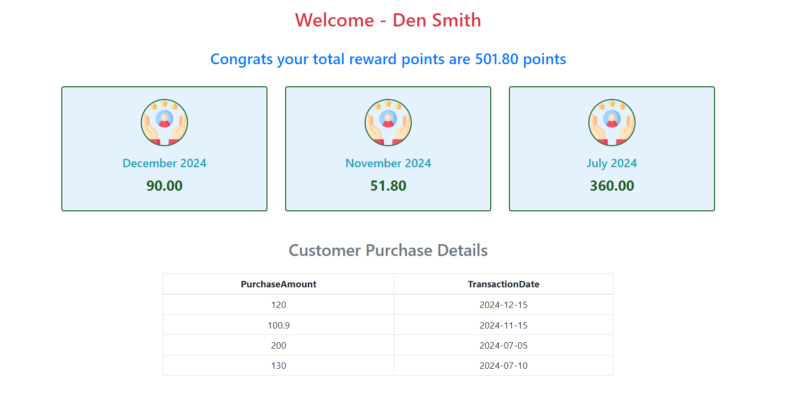

<!--Customer Rewards Dashboard -->
This project is a Customer Rewards Dashboard that displays customer reward details, including total rewards and monthly points of 3 months. The project uses React and Bootstrap to create a visually appealing and responsive interface.

# Details

# CalculatePoints.js
This function calculates reward points based on the purchase amount. The rules are:
For amounts greater than 100, points are calculated as 2 * (amount - 100) + 50.
For amounts between 50 and 100, points are calculated as amount - 50.
For amounts 50 or less, no points are awarded.

# RewardPage Component
The RewardPage component handles the logic. It fetches data, calculates rewards, and passes the necessary props to the RewardPageView component.

<!--Fetchdata function-->

This function fetches the transaction data and customer name from the JSON file and updates the state:
setCustData is used to store the fetched data.

<!-- Calculate Rewards Function -->
This function calculates the rewards for the filtered transactions.
For each transaction, it calculates the points and aggregates them by month and year.
It then extracts the last three months of points and calculates the total points for those months.
The getMonthYearName function converts a month-year string into a readable format.
<!--  -->

# RewardPageView Component
The RewardPageView component handles the design. It displays the customer reward details, including total rewards and monthly points, using Bootstrap classes for styling.

# UserTable Component
The UserTable component displays a table of customer transactions.

# JSON Data
The project uses a sample JSON dataset to display customer transactions

<!--Screenshot of dashboard-->
